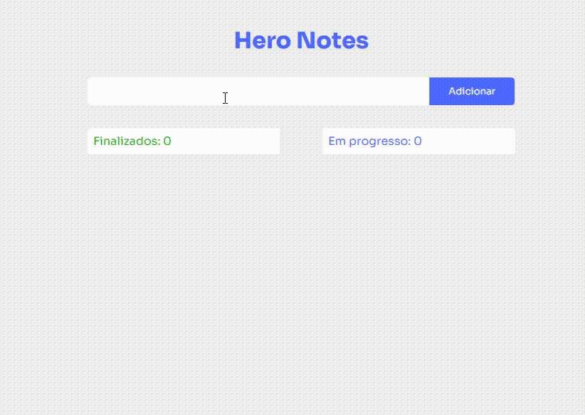

# Hero Notes

### CRUD - ✔👀📝❌- Projeto desenvolvido com **Vite**, **React** e **TypeScript**


<h2 align="center" >Visualização do projeto</h2>

</img>


<h3 align="center">
<P align="center" >Hospedado na <b>AWS</b></P>
    <a href="https://main.d70t7xxdgi3vx.amplifyapp.com/">Acessar demonstração</a>
</h3>

## Tecnologias utilizadas

- [ReactJS](https://reactjs.org)
- [TypeScript](https://www.typescriptlang.org/)

---


##  Como baixar o projeto

```bash
    # Clonar o repositório
    $ git clone https://github.com/jailtonmendes/react-hero-notes

    # Entrar no diretório
    $ cd react-hero-notes

    # Instalar as dependências
    $ yarn install

    # Iniciar o projeto
    $ yarn dev
```


